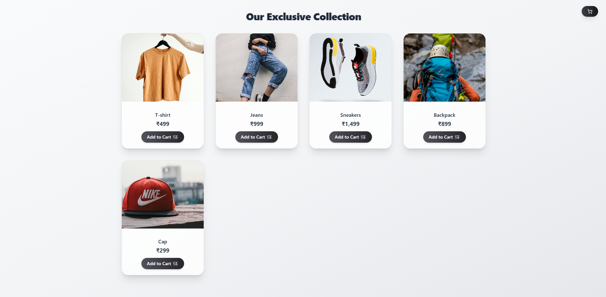
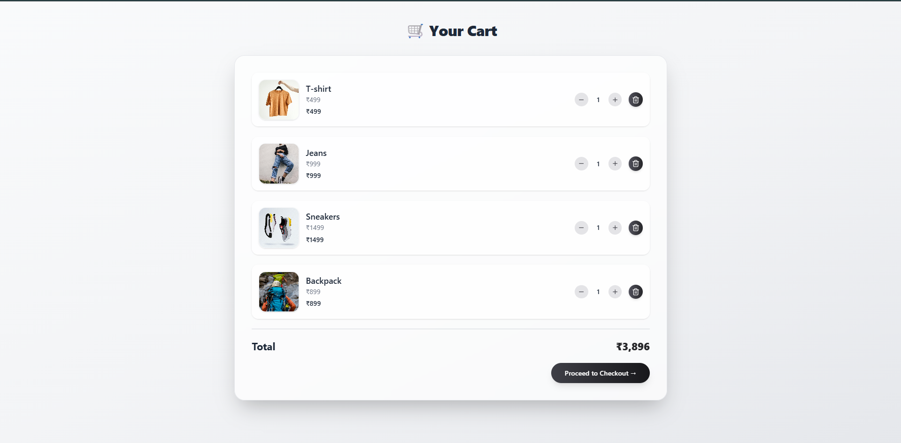
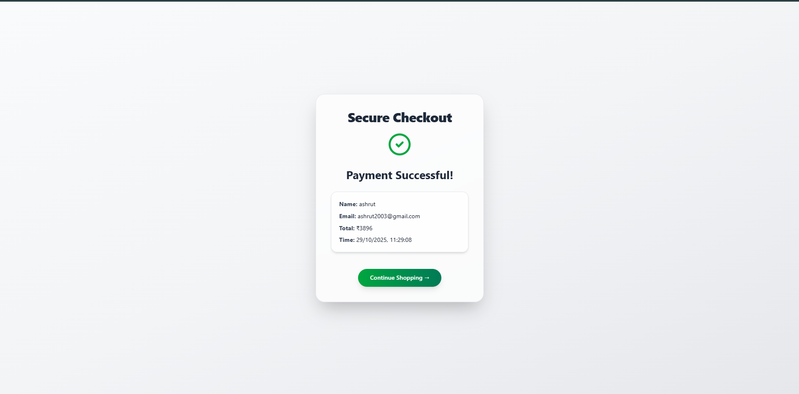

#  Vibe Project

A modern full-stack MERN eCommerce app with premium GenZ design.

---

## ⚙️ Setup Instructions

### 1️⃣ Clone the repo
```bash
git clone https://github.com/Ashrut20/vibe-project.git
cd vibe-project


### Backend  Setup
cd backend
npm install
npm start


### Frontend Setup
cd ../frontend
npm install
npm run dev


###URLs

Backend → http://localhost:5000
Frontend → http://localhost:5173


###  Product Page  


###  Cart Page  


###  Checkout Page  



Demo Video

Watch the full demo here 
🎬 Loom Demo – https://www.loom.com/share/664df09cbeef461fb4e224a492f41098     -> paste this link on browser to watch

GitHub Repo: https://github.com/Ashrut20/vibe-project

Ashrut Gupta
github-username Ashrut20